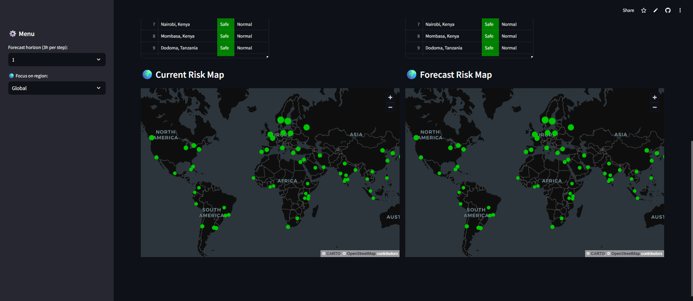
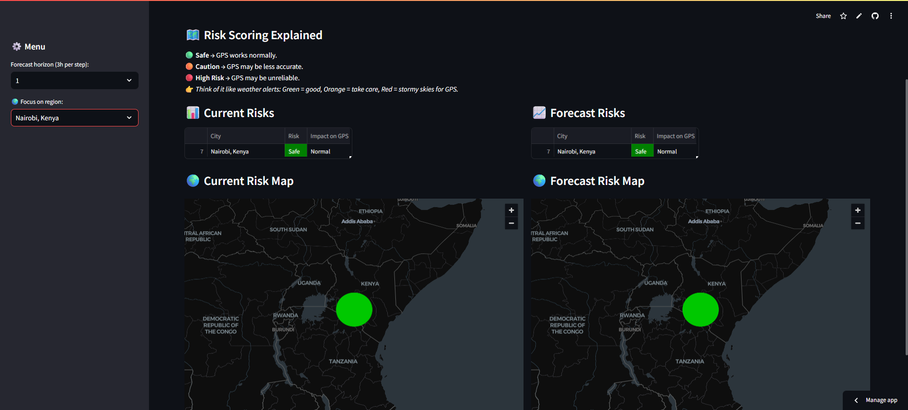

## **🛰️ SolarShield - GPS Risk Monitor**

A Streamlit web application that monitors space weather (solar storms) and their potential impact on GPS signal reliability across different regions of the world.

The app integrates live Kp index data and 3-day forecasts from NOAA SWPC and translates them into simple, human-readable GPS risk categories:

🟢 Safe → GPS works normally

🟠 Caution → GPS may be less accurate

🔴 High Risk → GPS may be unreliable

### **🚀 Deployed App**

Try it live here:
👉 [SolarShield GPS Risk Monitor](https://geomagnetic-energy-risk-monitoring-system-bqpbrbuln3hnxkrct3iv.streamlit.app/)

### **🚀 Powerpoint presentation**

Find the .ppt here:
👉 [SolarShield GPS Risk Monitor](https://github.com/Lynn-rose/Geomagnetic-Energy-Risk-Monitoring-System/blob/main/SolarShield%20Presentation%20-%20NanInSpace%20Group.pptx)

 ### **✨ Features**

✅ Live fetch of NOAA planetary Kp index (1-minute cadence)

✅ Auto-refresh with countdown & browser timezone detection

✅ Interactive maps showing risk levels across global regions

✅ Side-by-side view: current risks vs forecasted risks

✅ Simple, community-friendly risk scoring explanation

✅ Focus on a specific region or city or view global risks

### **🛠️ Tech Stack**

Python 3.11

Streamlit
 – web app framework

PyDeck
 – interactive mapping

Pandas
 – data processing

Requests
 – fetch external APIs

pytz
 – timezone handling

### **📦 Installation**

Clone this repo:

`git clone https://github.com/Lynn-rose/Geomagnetic-Energy-Risk-Monitoring-System.git`

`cd Geomagnetic-Energy-Risk-Monitoring-System`

Create a virtual environment and install dependencies:

`pip install -r requirements.txt`

Run the app:

`streamlit run app.py`

### **🌍 Usage**

Open the app in your browser (Streamlit will give you a local URL).

Choose a region in the sidebar or stay on Global view.

See current risks (left) and forecasted risks (right).

Hover over map points to view risk details for each city.

Use the Refresh Now button or let the app auto-refresh every 60s.

### **📡 Data Sources**

NOAA SWPC:

Current Kp Index: [planetary_k_index_1m.json](https://services.swpc.noaa.gov/json/planetary_k_index_1m.json)

Forecast: [3-day-forecast.txt](https://services.swpc.noaa.gov/text/3-day-forecast.txt)

### **📸 Screenshots**
Global Risk Overview

Regional Focus (e.g., Nairobi, Kenya)

### **🚀 Future Improvements**

 Add mobile-friendly UI tweaks

 More granular local forecasts

 Historical Kp trends visualization

 Whatsapp/SMS alerts for high-risk periods

### **👨‍💻 Author**

Developed by **Nan in Space**

✉️ Contact: 
- Leonard Gachimu [leogachimu@gmail.com](https://www.linkedin.com/in/leonard-gachimu/)

- Lynn Rose [lynn90952@gmail.com](https://www.linkedin.com/in/lynn-achieng-382939192/)
            
 - Ann Kandie [annkandie@yahoo.com](https://www.linkedin.com/in/ann-kandie-121b3481)

- Kariuki Reuben [kariukireuben734@gmail.com](https://www.linkedin.com/in/kr2026/ )

- Bismita [bismitain@gmail.com](https://www.linkedin.com/in/bismita-hazarika-49275357/)